# Scrimly — Tournament Management SaaS for Battle Royale Esports

**Live:** [scrimly.xyz](https://scrimly.xyz) &nbsp;·&nbsp; **Stack:** Django · React · PostgreSQL · Redis · Celery · Docker · Supabase Auth

A full-stack SaaS platform sole-developed over ~4 months. Scrimly handles the full lifecycle of a mobile esports tournament — from org setup and registration to live check-in, scoring, and public leaderboards.

No existing platform owned this workflow for battle royale games (COD Mobile, PUBG Mobile, etc.) — scoring was done manually in spreadsheets. Scrimly automates it end-to-end, including AI-powered score extraction from in-game screenshots.

---

## Key Engineering Work

- **Multi-tenant architecture** — orgs with Owner → Admin → Manager → Member RBAC, resource isolation, and per-plan limits enforced at the API layer
- **Registration engine** — draft/submit/approve workflow with waitlists, slot management, Discord OAuth verification, blacklisting, and withdrawals
- **Billing system** — Paddle integration with tiered subscriptions, free trials, credit-based AI usage, webhook processing, and a full billing portal
- **AI score extraction** — Vision AI (Qwen VL) parses game screenshots; finds all teams and kills in a match in 1-2 minutes instead of manual entry over hours
- **Configurable scoring** — per-tournament scoring rules, kill/placement multipliers, player-level metrics, manual adjustments, and CSV export
- **Production ops** — self-hosted VPS with Traefik reverse proxy, zero-downtime deploys, hourly Cloudflare R2 backups, and Sentry error monitoring
- **Test coverage** — 1,783 backend tests (Pytest) + 126 client tests (Vitest) covering registration flows, scoring logic, billing, and permissions

---

## Screenshots

### Dashboard

The organizer dashboard surfaces active registrations, recent notifications, and pending actions across all their tournaments.

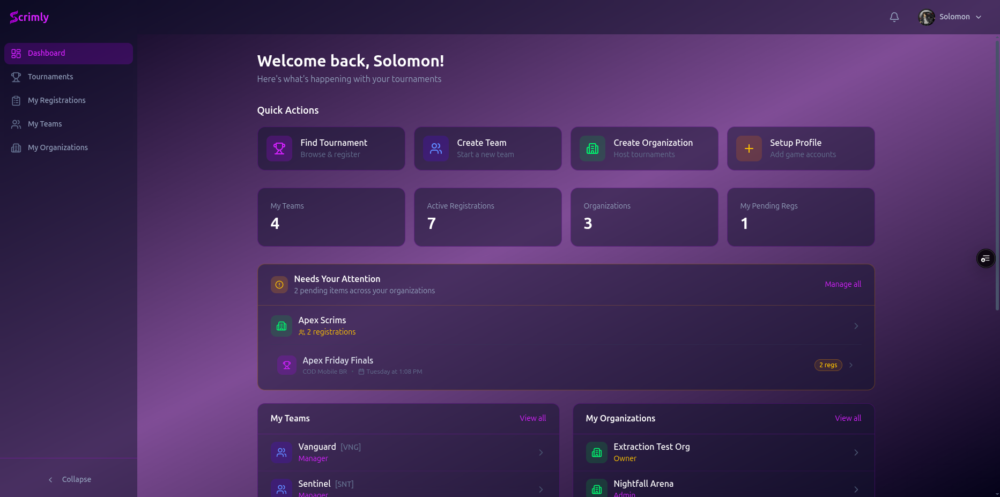

---

### Tournament Overview (Admin)

Each tournament has a dedicated admin hub with stats, schedule, and configuration at a glance.

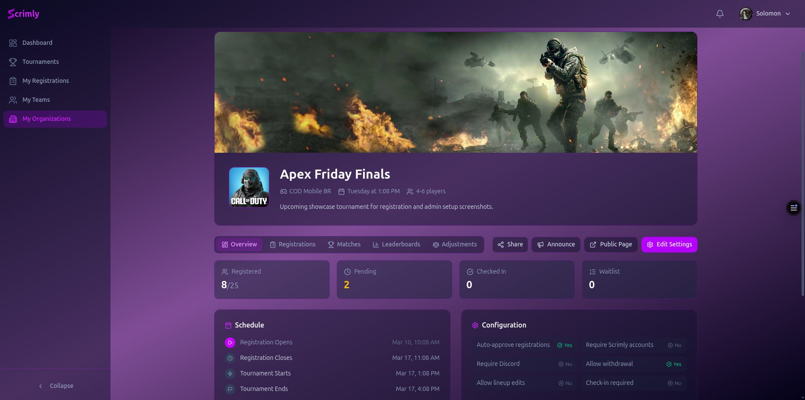

---

### Registration Management

Organizers manage registrations across status tabs (Pending, Registered, Waitlist, Rejected, No Show) with bulk approval, copy-to list, and per-row actions.

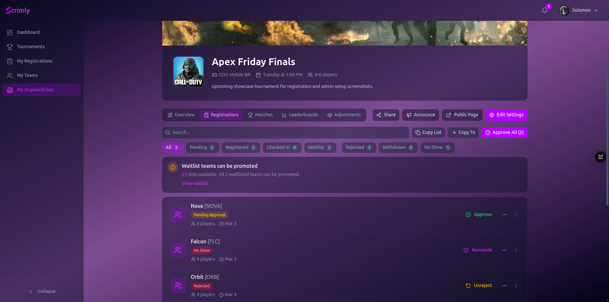

---

### Registration Detail (Player View)

Teams see their full registration state — approval timeline, manager info, emergency contact, and full player lineup with IGN, Discord handle, Twitter, and preferred role.

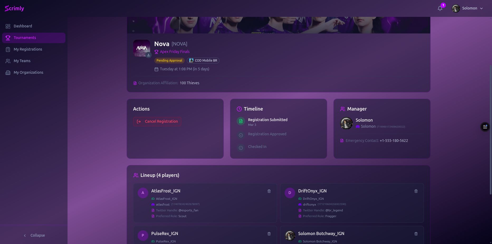

---

### Tournament Edit Wizard — Basic Info

Organizers configure tournaments through a 6-step wizard. Title, slug, game type, region, logo, and banner are set in step 1.

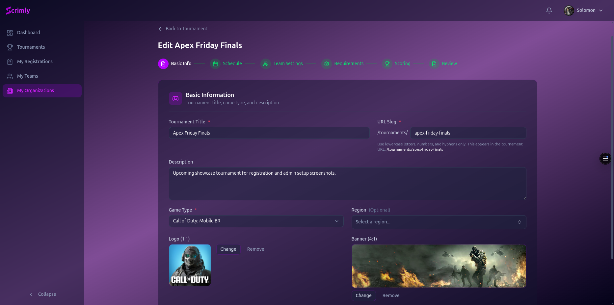

---

### Tournament Edit Wizard — Schedule

Step 2 configures registration window, tournament dates, and an optional check-in window with toggle.

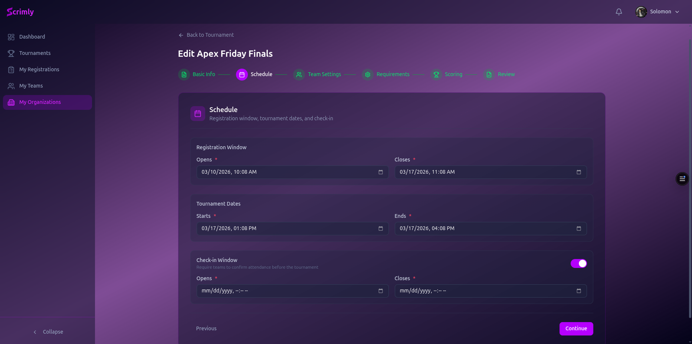

---

### Leaderboard Admin

Tournament directors configure multiple leaderboards per tournament — team standings, player stats — with visibility toggles and sorting rules.

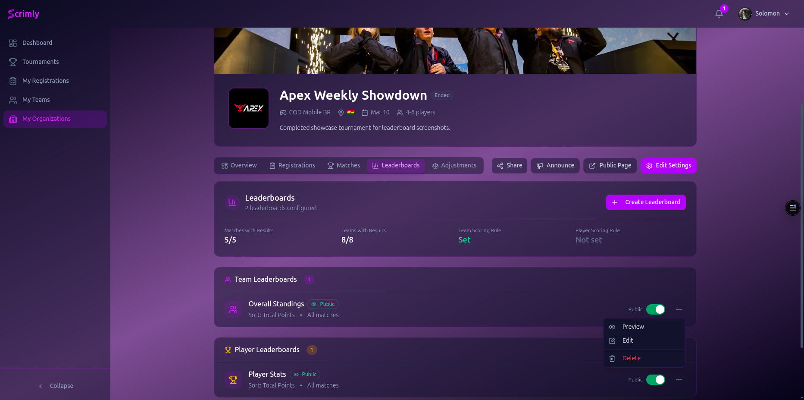

---

### Public Tournament Page with Live Standings

The public-facing tournament page shows tournament info, schedule, registration requirements, and embedded leaderboard with full standings.

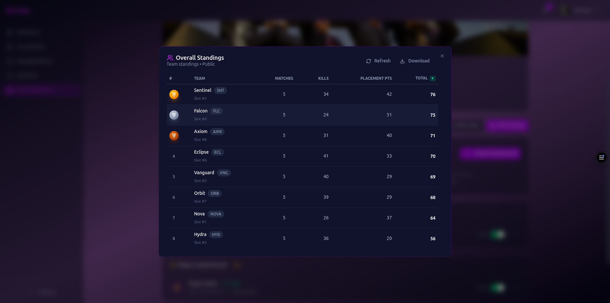

---

### Admin Leaderboard Preview

Tournament admins can preview individual leaderboards from the admin panel before they go live. The preview modal shows the full standings with Refresh and Download options.

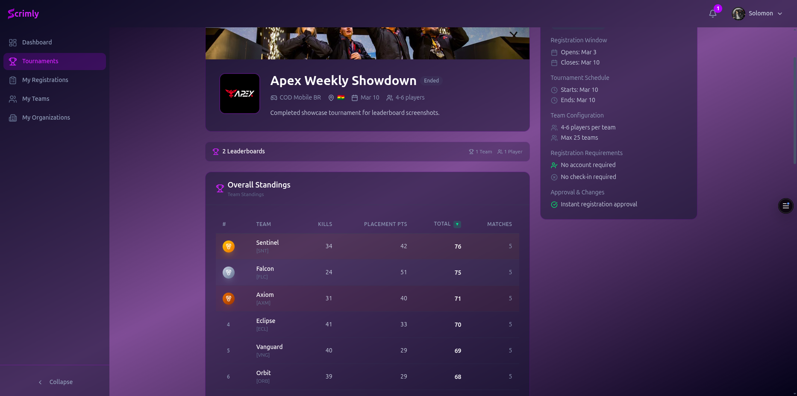

---

### Score Entry — Per-Team and Per-Player

The score entry modal shows all registered teams in a 3-column grid. Each team can be expanded to enter per-player kill counts alongside team-level kills and placement.

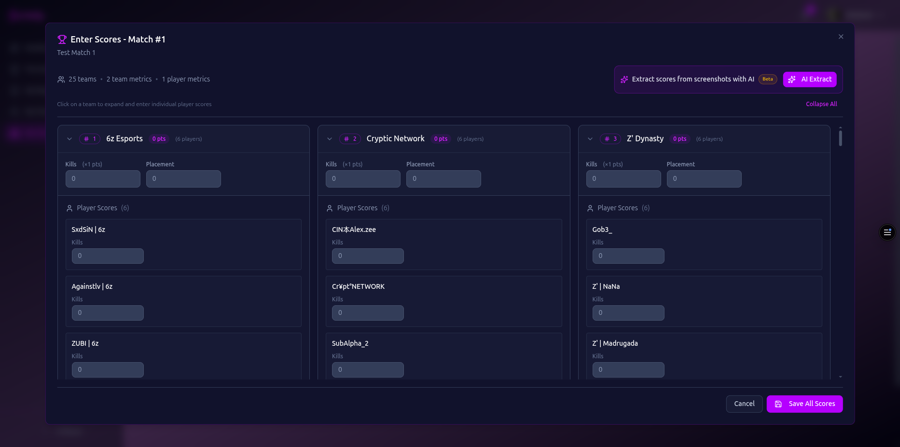

---

### AI Score Extraction

The standout feature: organizers upload match screenshots and Scrimly's AI (Qwen VL) extracts placement and kill data for every team automatically.

**Step 1 — Upload game screenshots (up to 8 files)**

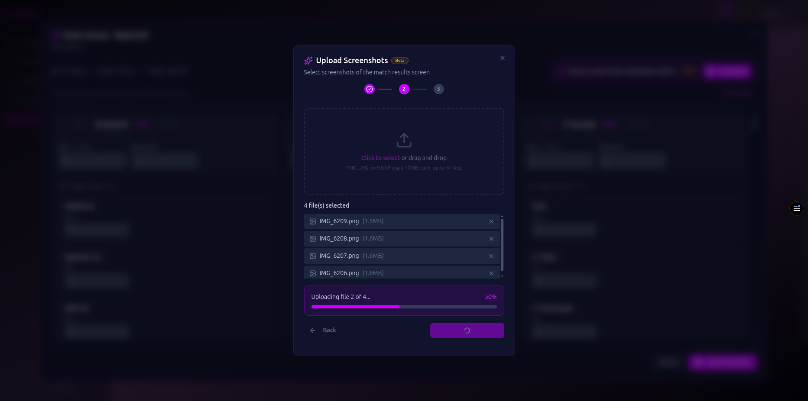

**Step 2 — AI processes screenshots**

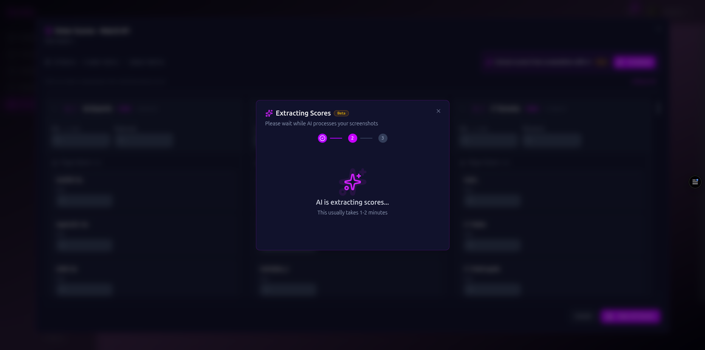

**Step 3 — Review extracted results before applying (25/25 teams found)**

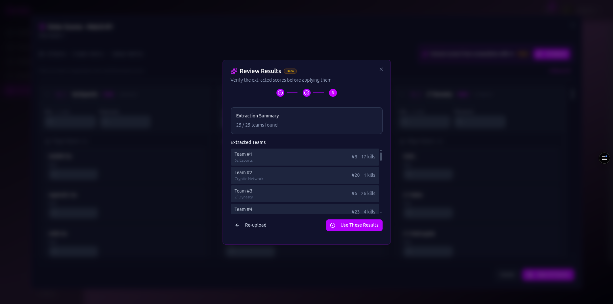

---

## Tech Stack

| Layer             | Technologies                                                              |
| ----------------- | ------------------------------------------------------------------------- |
| **Backend**       | Python 3.13, Django 5.2, Django REST Framework                            |
| **Frontend**      | React 19, TypeScript, TanStack Router/Query, Tailwind CSS, shadcn/ui      |
| **Database**      | PostgreSQL (soft deletes, row-level constraints, optimized indexes)       |
| **Cache / Queue** | Redis + Celery (async tasks, AI job processing, rate limiting)            |
| **Auth**          | Supabase JWT with JWKS validation (Discord OAuth for player verification) |
| **Billing**       | Paddle (subscriptions, webhooks, credit system)                           |
| **AI**            | Qwen VL via Alibaba Cloud (vision model for screenshot parsing)           |
| **Infra**         | Docker Compose, Traefik, self-hosted VPS, Cloudflare R2, Sentry           |
| **Testing**       | Pytest (1,783 tests), Vitest (126 tests), factory_boy, coverage reporting |

---

## Selected Technical Decisions

**Why self-hosted over managed cloud?** To demonstrate full-stack ownership — Traefik config, SSL, backup automation, container orchestration, zero-downtime deploy strategy.

**Why Paddle over Stripe?** Paddle acts as Merchant of Record, handling global VAT/tax compliance automatically. Better fit for a SaaS targeting international orgs.

**Why Qwen VL for AI extraction?** Higher accuracy on game UI screenshots (HUD layouts, non-standard fonts) than alternatives tested. API cost structure also maps well to a credit-based billing model.

**Why DRF over alternatives?** The registration and scoring logic involves deeply nested validation, state machines, and permission checks at multiple layers. DRF's ViewSet + serializer pattern and mature ecosystem kept complexity manageable across 1,700+ tests.

---

*Source code is private. Staging demo available — contact me for access.*
